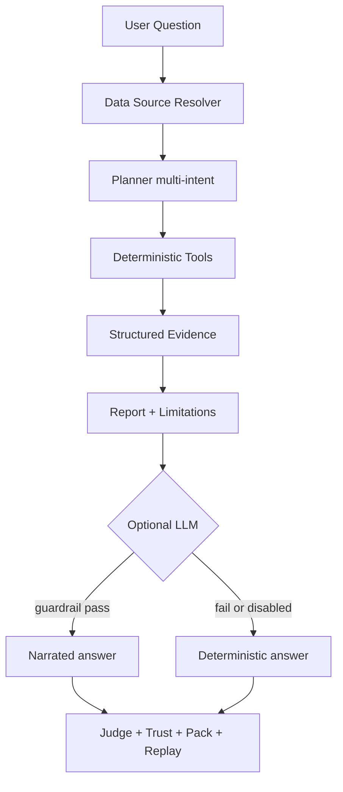

# BondLens AI

**An evidence-first bond analysis agent for Chinese market data**

[English](README.md) | [中文](README.zh-CN.md)


```text
Numbers are code-calculated.
Narratives are LLM-assisted.
Every output is provenance-tracked.
```

BondLens is a lightweight AI agent platform for **Chinese bond market analysis**.
It unifies deterministic analytics, optional LLM narration, and a reviewer-facing Trust Layer —
so every number can be audited, every answer can be replayed, and every limitation is stated honestly.

> Non-investment advice. For learning, research, portfolio demonstration, and interview discussion only.

Project page: [https://phoenix0531-sudo.github.io/BondLens/](https://phoenix0531-sudo.github.io/BondLens/)

Static demo packs (no API key): [docs/demo_runs/](docs/demo_runs/)

---

## Design Principle: Deterministic Compute, LLM Narration

A core design principle of BondLens (shared with platforms such as FinRobot) is the strict separation between **deterministic financial computation** and **LLM-based narration**.

| Layer | What produces it | Can invent numbers? |
| --- | --- | --- |
| Yield / volume / percentiles / rankings | Deterministic tools (`bond_agent/tools.py`) | No |
| Taxonomy / maturity buckets / peer spread | Rule-based classifiers + pure Python stats | No |
| Data lineage (live / snapshot / static) | Data resolver | No |
| Evidence ledger claims | Built from tool outputs | No |
| Final narrative text | Deterministic report, or LLM only if guardrail + judge pass | Text only; numbers must match evidence |

In short: tools compute, models narrate, trust decides.

---

## What BondLens Does

BondLens turns a natural-language bond question into an **auditable analysis run**:

1. Resolve data (live AkShare → cached snapshot → local Excel)
2. Plan intent (overview / search / ranking / outliers / monitor / composite / bond report)
3. Run deterministic tools
4. Build structured evidence (market, peer, monitor, quality, maturity coverage)
5. Compose a report with risk notes and mandatory limitations
6. Optionally polish with an LLM under numeric + language guardrails
7. Score trust, export a Bond Evidence Pack, and store a replay summary

### Product surfaces (answer-first)

- **Answer Snapshot**: 3-sentence headline + key metrics; full body collapsed by default
- **Bond type mix + maturity buckets**: conservative name-rule taxonomy (no rating inference)
- **Peer comparison**: same type + maturity bucket spread vs peers
- **Cross-section monitor board**: high yield / low volume / yield outliers / missing maturity
- **Maturity enrichment board**: live coverage ratio, source counts, unmatched list export (CSV/JSON)
- **Trust score + stress view + audit folds**: guardrail / judge / risk / ledger behind details

---

## Architecture

```text
Data Ops      live / snapshot / static sample + lineage + maturity enrichment
Agent Core    Planner → Tools → Evidence → Report
Trust Layer   Guardrail + Judge + Risk Profile + Trust Score + Replay + Evals
```



Inspired by *deterministic compute, LLM narration* research platforms, BondLens specializes the idea for **Chinese bonds** with claim-level evidence, answer judging, red-team evals, and reviewer-facing evidence packs — not a multi-role equity research desktop.

---

## Screenshots

> UI screenshots will be recaptured after the product surface is fully stabilized.
> Current images under `docs/screenshots/` reflect an earlier workbench revision.

<table>
  <tr>
    <td width="50%">
      
      <br><strong>Agent Workbench</strong>
    </td>
    <td width="50%">
      
      <br><strong>Answer, Tool Trace, and Evidence</strong>
    </td>
  </tr>
  <tr>
    <td width="50%">
      
      <br><strong>Risk Profile and Answer Judge</strong>
    </td>
    <td width="50%">
      
      <br><strong>Replay Dashboard</strong>
    </td>
  </tr>
</table>

---

## Quick Start

### 5 minutes (offline demo)

```bash
pip install -r requirements.txt
export BOND_DATA_MODE=static
python app.py
# open http://127.0.0.1:5000/agent
# try: 当前样本收益率分布是什么样？
```

Or open a pre-generated pack with no server:

- [demo-market-overview.html](docs/demo_runs/demo-market-overview.html)
- [demo-bond-report.html](docs/demo_runs/demo-bond-report.html)
- [demo-yield-outliers.html](docs/demo_runs/demo-yield-outliers.html)

### 30 minutes (live path + fallback)

```bash
export BOND_DATA_MODE=auto   # live first, then snapshot, then static
python app.py
# force live: BOND_DATA_MODE=live
# watch data_source.runtime_mode, maturity board, and trust score when live degrades
```

Optional LLM polish (never required):

```bash
export OPENAI_API_KEY=...
# or OPENAI_BASE_URL for OpenAI-compatible local endpoints
```

---

## Tool Catalog (deterministic operators)

| Tool | Inputs | Deterministic outputs |
| --- | --- | --- |
| `search_bonds` | name / type / maturity / yield filters | match_count, records |
| `describe_market` | active frame | yield/volume summaries, segments, data quality |
| `rank_bonds` | by, top_n, order | ranked records |
| `detect_yield_outliers` | method, threshold | outlier_count, scores |
| `compare_bond_to_market` | bond / record | percentiles, peer comparison |
| `build_market_monitor` | top_n | high-yield / low-volume / outliers / missing maturity |
| `generate_bond_report` | tool outputs + plan | analysis, risk notes, limitations |

Numbers in the final answer must come from these tools (or be rejected by the guardrail).

---

## Trust Score & Evidence Pack

Each answer includes `trust_score` (0–100) built from evidence quality, data freshness/degradation,
ledger coverage, guardrail outcome, judge outcome, and a forced non-advisory penalty.

Every run can export a portable **Bond Evidence Pack** (JSON + static HTML):

- question / intent / tools
- data lineage + maturity coverage
- trust score + adjustments
- guardrail + judge + risk profile
- evidence ledger + final answer
- mandatory limitations

```bash
python scripts/generate_demo_packs.py
```

Runtime packs: `.tmp/evidence_packs/`  
Committed demos: [docs/demo_runs/](docs/demo_runs/)

### Maturity unmatched export

Live/snapshot feeds have **no native maturity field**. BondLens enriches matched names from the local security master and exposes:

```text
GET/POST /api/maturity/unmatched?format=csv&data_mode=static
GET/POST /api/maturity/unmatched?format=json&data_mode=static
```

The UI maturity board links to the same export for unmatched bond names.

---

## Example Questions

```text
当前样本收益率分布是什么样？
搜索23附息国债26并给出收益率分析
打开今日市场监控面板：高收益、低成交与异常
按收益率列出最高的前5只债券
有没有收益率异常的债券？
筛选国债收益率大于 2.5 的债券
```

---

## API

```http
POST /api/agent/query
Content-Type: application/json

{
  "question": "搜索23附息国债26并给出收益率分析",
  "data_mode": "auto"
}
```

Operational endpoints:

```text
GET  /healthz
GET  /api/agent/schema
GET  /replay
GET  /packs/<pack_id>.html
GET  /packs/<pack_id>.json
GET  /api/maturity/unmatched
```

Deployment notes: [docs/deployment.md](docs/deployment.md)

---

## Data Source Boundary

```text
Primary:        AkShare bond_spot_deal
Snapshot:       .tmp/bond_spot_deal_snapshot.csv
Final fallback: data/testdata.xlsx
```

- Live feed fields used: bond name, clean price, latest yield, BP change, weighted yield, volume
- **No native maturity** on live feed → enrichment from local static master + `maturity_coverage`
- No issuer ratings, financial statements, guarantees, or credit events
- Yield is a **risk signal**, not a trade instruction

Modes:

```text
auto   -> live first, cached snapshot second, local fallback third
live   -> live source requested; fallback reason shown if it degrades
static -> local Excel only
```

---

## Why This Is An Agent, Not A Chatbot

1. **Data resolver** chooses live / snapshot / static with honest lineage
2. **Planner** classifies multi-intent and selects tools
3. **Tools** run pure Python analytics over the active frame
4. **Evidence** is structured and ledger-backed
5. **Report** is composed from evidence with risks and limitations
6. **Optional LLM** may narrate only after local evidence exists
7. **Guardrail + judge** accept or reject model text
8. **Trust score + Evidence Pack + replay** make the run reviewable without dumping raw JSON

If `OPENAI_API_KEY` is not set, the project still runs with deterministic fallback output.

---

## Background

This project started as a 2024 undergraduate thesis: a Flask-based bond data analysis system.
The original thesis version is preserved and should not be rewritten:

- Original thesis branch: `undergraduate-thesis-2024`
- Current branch: `main`

## License

MIT

## Disclaimer

BondLens AI is an engineering and research demonstration. It does not provide investment advice,
does not claim complete market coverage, and does not replace professional fixed-income research tools.
