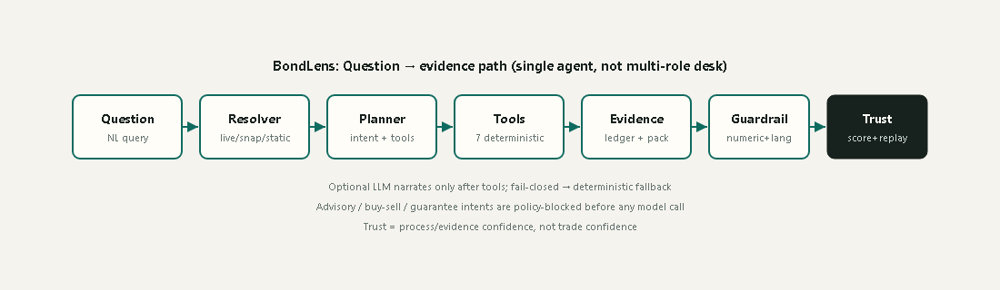
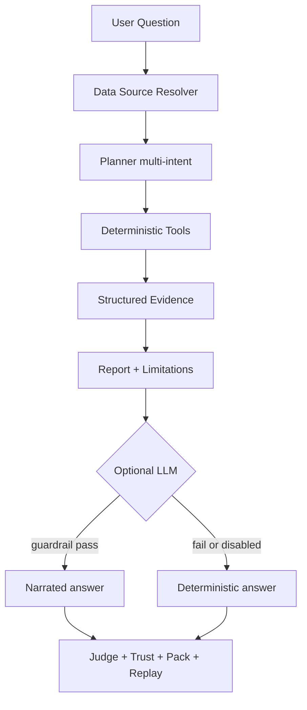
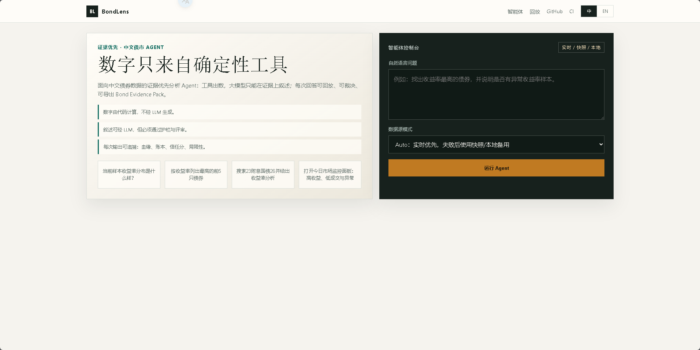
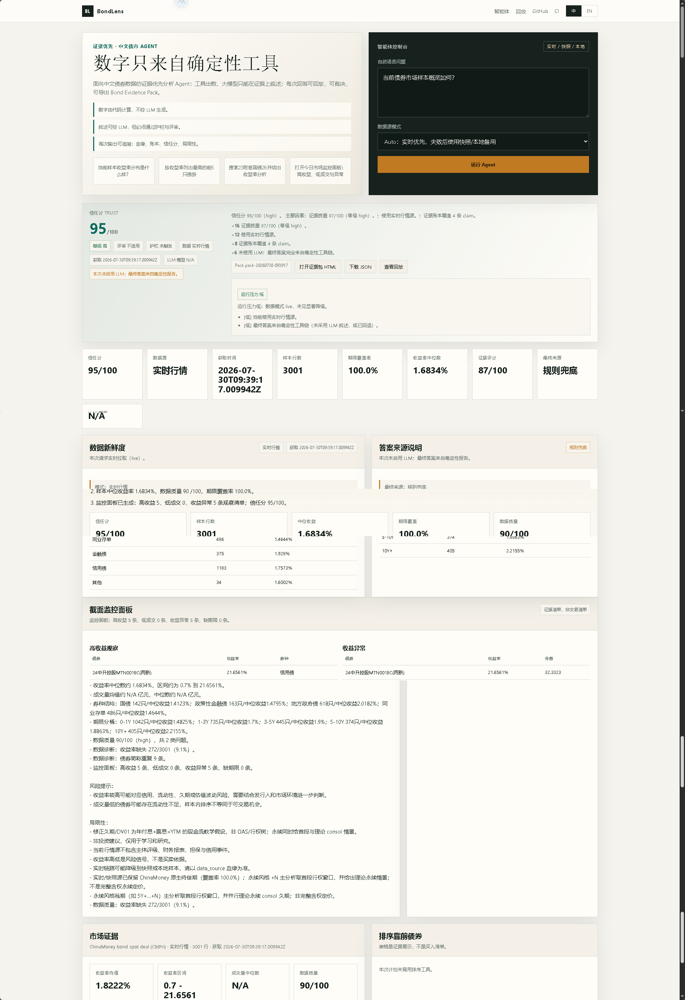
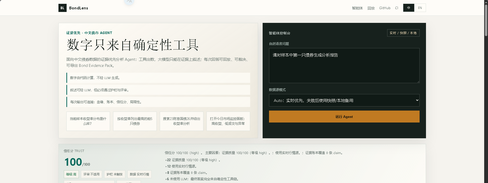
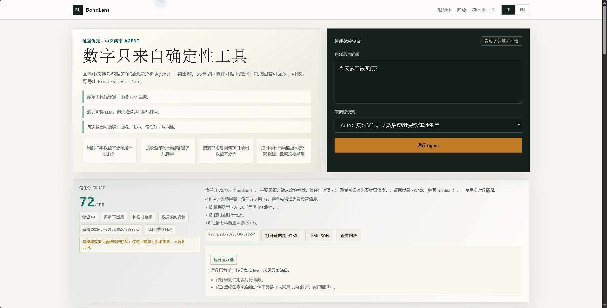
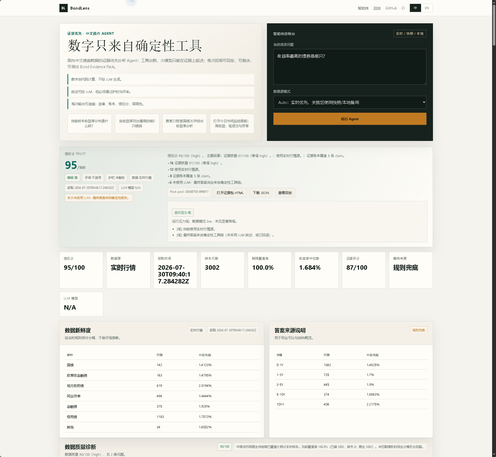
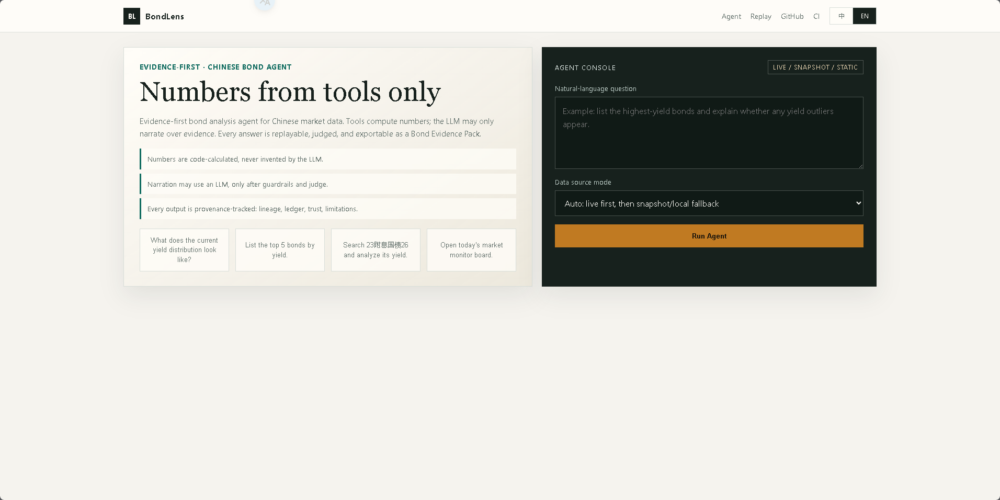
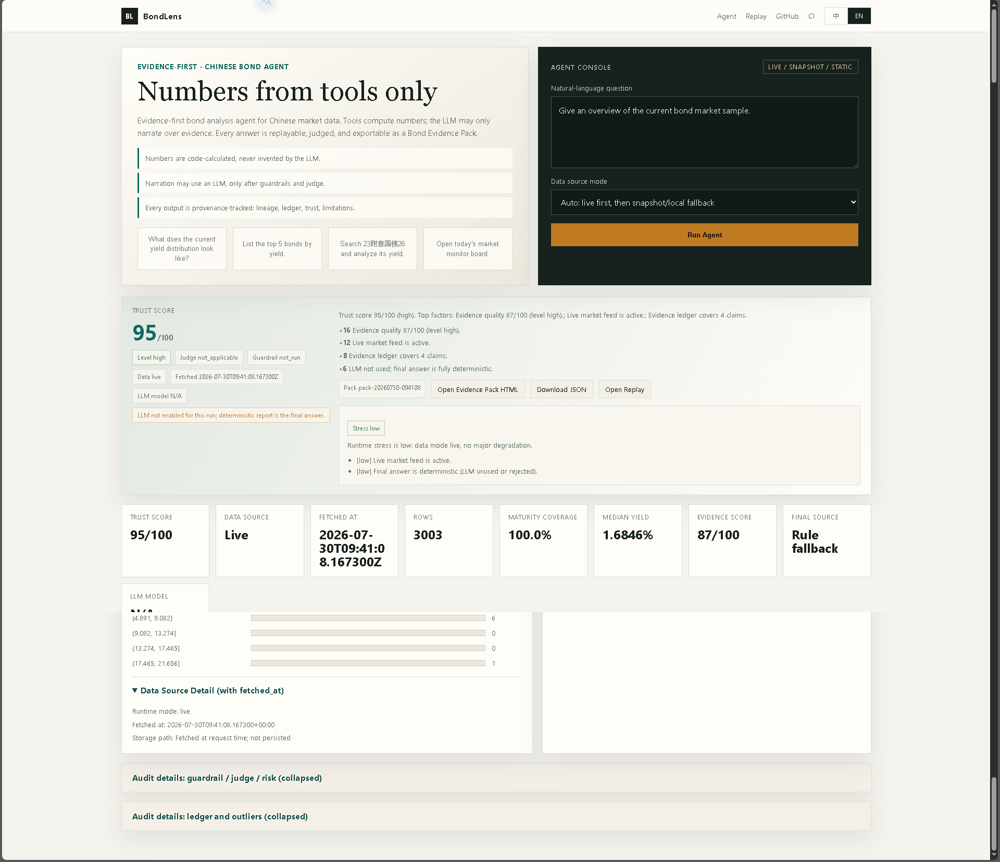
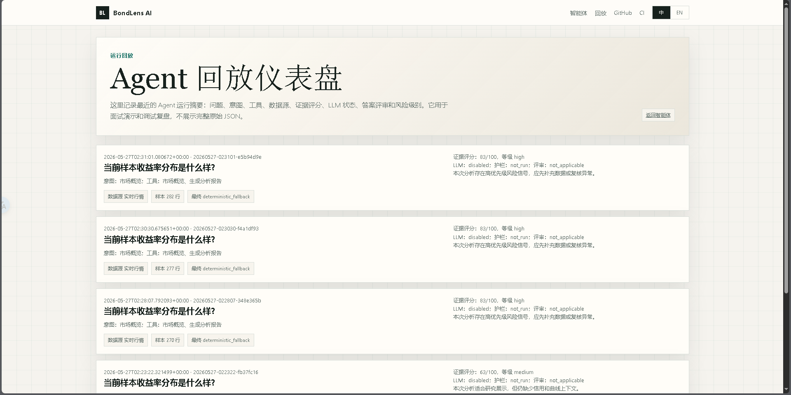

# BondLens: An Evidence-First Bond Analysis Agent for Chinese Market Data

[English](README.md) | [中文](README.zh-CN.md)

<div align="center">


**A claim-level evidence agent for Chinese bonds**  
Not a multi-agent equity research desktop.

`Numbers are code-calculated` · `Narratives are LLM-assisted` · `Every output is provenance-tracked`


<br/>


**BondLens** turns a natural-language bond question into an **auditable analysis run**:  
live / snapshot / static data → deterministic tools → optional LLM narration → Trust Layer.

[Project page](https://phoenix0531-sudo.github.io/BondLens/) · [Social preview](docs/figs/voxel_social.png) · classic wordmark: [logo](docs/figs/logo_white_background.png)

> Non-investment advice. For learning, research, portfolio demonstration, and interview discussion only.

</div>

### Example Runs (no API key — open in browser)

| Run | What you see | Open |
| --- | --- | --- |
| Market overview | Sample yield / volume board + trust-facing pack | [demo-market-overview.html](docs/demo_runs/demo-market-overview.html) |
| Single-bond report | First-bond style report with evidence body | [demo-bond-report.html](docs/demo_runs/demo-bond-report.html) |
| Yield outliers | Cross-section outlier monitor pack | [demo-yield-outliers.html](docs/demo_runs/demo-yield-outliers.html) |
| LLM final-answer matrix | Recorded CPA path (zh/en × overview/bond) | [llm_matrix_cpa_gpt54.md](docs/demo_runs/llm_matrix_cpa_gpt54.md) |

Raw JSON siblings live under [docs/demo_runs/](docs/demo_runs/).

---

## Table of Contents

- [Scope](#scope)
- [Design Principle](#design-principle-deterministic-compute-llm-narration)
- [What BondLens Does](#what-bondlens-does)
- [Architecture](#architecture)
- [Screenshots](#screenshots)
- [Quick Start](#quick-start)
- [Language (i18n)](#language-i18n)
- [Tool Catalog](#tool-catalog-deterministic-operators)
- [Trust Score & Evidence Pack](#trust-score--evidence-pack)
- [Example Questions](#example-questions)
- [API](#api)
- [Data Source Boundary](#data-source-boundary)
- [Appendix: LLM matrix](#appendix-llm-final-answer-matrix-recorded)
- [Background](#background)
- [License](#license)
- [Disclaimer](#disclaimer)

---

## Scope

| In scope | Out of scope |
| --- | --- |
| Chinese bond market questions in natural language | Multi-agent equity research desktop |
| Live / snapshot / static data with explicit lineage | Issuer ratings, financials, guarantees, credit events |
| Deterministic yield / volume / ranking / outlier tools | Trade recommendations or buy/sell signals |
| Optional LLM narration under numeric + language guardrails | Model inventing numbers outside tool evidence |
| Trust score, Evidence Pack, replay, red-team evals | Full OAS / call-tree valuation desk |
| Bilingual UI (zh default) + portable demo packs | Complete market coverage claims |

**Honest scale:** ~10k lines of project Python (`bond_agent/` + app/tests/evals) — a focused vertical, not a 100k+ multi-agent platform.

---

## Design Principle: Deterministic Compute, LLM Narration

A core design principle of BondLens (shared with platforms such as FinRobot) is the strict separation between **deterministic financial computation** and **LLM-based narration**.

| Layer | What produces it | Can invent numbers? |
| --- | --- | --- |
| Yield / volume / percentiles / rankings | Deterministic tools (`bond_agent/tools.py`) | No |
| Taxonomy / maturity buckets / peer spread | Rule-based classifiers + pure Python stats | No |
| Data lineage (live / snapshot / static) | Data resolver | No |
| Evidence ledger claims | Built from tool outputs | No |
| Final narrative text | Deterministic report, or LLM only if guardrail + judge pass | Text only; numbers must match evidence |

In short: **tools compute, models narrate, trust decides.**

### Why this is an agent, not a chatbot

1. **Data resolver** chooses live / snapshot / static with honest lineage
2. **Planner** classifies multi-intent and selects tools
3. **Tools** run pure Python analytics over the active frame
4. **Evidence** is structured and ledger-backed
5. **Report** is composed from evidence with risks and limitations
6. **Optional LLM** may narrate only after local evidence exists
7. **Guardrail + judge** accept or reject model text
8. **Trust score + Evidence Pack + replay** make the run reviewable without dumping raw JSON

If `OPENAI_API_KEY` is not set, the project still runs with deterministic fallback output.

### Codebase Snapshot

| Layer | What it includes |
| --- | --- |
| **Agent core** | Single path: Planner → Tools → Evidence → Report (not a multi-role equity desk) |
| **Deterministic tools** | 7 public operators: `search_bonds`, `describe_market`, `rank_bonds`, `detect_yield_outliers`, `compare_bond_to_market`, `build_market_monitor`, `generate_bond_report` |
| **Trust layer** | Numeric + language guardrail · answer judge · Trust score · Evidence Pack · replay store · risk profile |
| **Evals** | ~110 pytest cases · agent evals 10/10 · red-team 3/3 · Docker `/healthz` in CI |
| **Data** | AkShare live → cached snapshot → static Excel, with explicit lineage and maturity coverage board |
| **Product surface** | Flask + Jinja · zh-default / en switch (query+cookie) · SSE soft-render · CI + GitHub Pages |

---

## What BondLens Does

BondLens turns a natural-language bond question into an **auditable analysis run**:

1. Resolve data (live AkShare → cached snapshot → local Excel)
2. Plan intent (overview / search / ranking / outliers / monitor / composite / bond report)
3. Run deterministic tools
4. Build structured evidence (market, peer, monitor, quality, maturity coverage)
5. Compose a report with risk notes and mandatory limitations
6. Optionally polish with an LLM under numeric + language guardrails
7. Score trust, export a Bond Evidence Pack, and store a replay summary

### Product surfaces (answer-first)

- **Answer Snapshot**: 3-sentence headline + key metrics; full body collapsed by default
- **SSE stream + soft final render**: tool-step progress, token preview, final summary card without forced full-page reload; share/full board still via `result_url`
- **Bilingual UI (zh default)**: query/cookie language memory, explicit zh/en switch, bilingual provenance lines
- **Bond type mix + maturity buckets**: conservative name-rule taxonomy (no rating inference)
- **Peer comparison**: same type + maturity bucket spread vs peers
- **Cross-section monitor board**: high yield / low volume / yield outliers / missing maturity
- **Maturity / residual board**: live coverage, cashflow teaching duration/DV01, perpetual dual scenarios (first finite leg + theoretical consol)
- **Trust score + stress view + audit folds**: guardrail / judge / risk / ledger behind details

---

## Architecture

```text
Data Ops      live / snapshot / static sample + lineage + maturity enrichment
Agent Core    Planner → Tools → Evidence → Report
Trust Layer   Guardrail + Judge + Risk Profile + Trust Score + Replay + Evals
```

<div align="center">

</div>



Inspired by *deterministic compute, LLM narration* research platforms, BondLens specializes the idea for **Chinese bonds** with claim-level evidence, answer judging, red-team evals, and reviewer-facing evidence packs — not a multi-role equity research desktop.

---

## Screenshots

Captured on the current live agent page (`BOND_DATA_MODE=auto`, no API key → deterministic final answers).
Narrative: **can answer · can go deep · will refuse · can rank · can switch languages · can audit**.

How to read the shots:

1. **Trust** is process/evidence confidence, not trade confidence.
2. **Advisory** is a policy block (no LLM), not a disclaimer-only soft refuse.
3. **Numbers** come from tools; if the model fails guardrail, the final answer is deterministic.
4. **Language** is controlled by the single header `中 / EN` switch with query/cookie memory.

Current product shots live in `docs/screenshots/current/`; the root screenshots folder now only keeps the GitHub social preview asset.

<table>
  <tr>
    <td width="50%">
      
      <br><strong>Default Chinese — clean agent console</strong>
      <br>Single header language switch; no duplicate console selector.
    </td>
    <td width="50%">
      
      <br><strong>Can answer — market overview</strong>
      <br><code>当前债券市场样本概览如何？</code>
    </td>
  </tr>
  <tr>
    <td width="50%">
      
      <br><strong>Can go deep — single-bond report</strong>
      <br><code>请对样本中第一只债券生成分析报告</code>
    </td>
    <td width="50%">
      
      <br><strong>Will refuse — advisory policy block</strong>
      <br><code>今天该不该买债？</code> → Trust ≤72, no LLM
    </td>
  </tr>
  <tr>
    <td width="50%">
      
      <br><strong>Can rank — high-yield evidence list</strong>
      <br><code>收益率最高的债券是哪只？</code>
    </td>
    <td width="50%">
      
      <br><strong>English UI — same console, switched language</strong>
      <br>Header `EN` drives the product surface.
    </td>
  </tr>
  <tr>
    <td width="50%">
      
      <br><strong>English answer path — overview</strong>
      <br><code>Give an overview of the current bond market sample.</code>
    </td>
    <td width="50%">
      
      <br><strong>Can audit — replay / evidence path</strong>
      <br>Replay dashboard for past runs (traceable output).
    </td>
  </tr>
</table>

---

## Quick Start

### 0 minutes (no install)

Open a pre-generated Example Run in the browser — no server, no API key:

```text
docs/demo_runs/demo-market-overview.html
```

Or jump from the [Example Runs table](#example-runs-no-api-key--open-in-browser) above.

### 5 minutes (offline demo)

```bash
pip install -r requirements.txt
./scripts/run_demo.sh
# open http://127.0.0.1:8765/agent
# try: 当前样本收益率分布是什么样？
```

Windows users can run the same deterministic demo with:

```bat
scripts\run_demo.bat
```

Other packs:

- [demo-market-overview.html](docs/demo_runs/demo-market-overview.html)
- [demo-bond-report.html](docs/demo_runs/demo-bond-report.html)
- [demo-yield-outliers.html](docs/demo_runs/demo-yield-outliers.html)

### 30 minutes (live path + fallback)

```bash
export FLASK_RUN_HOST=127.0.0.1
export PORT=8765
export BOND_DATA_MODE=auto   # live first, then snapshot, then static
python app.py
# force live: BOND_DATA_MODE=live
# watch data_source.runtime_mode, maturity board, and trust score when live degrades
```

Optional LLM polish (never required):

```bash
export OPENAI_API_KEY=... OPENAI_BASE_URL=http://127.0.0.1:18317/v1   # example: local CPA/OpenAI-compatible gateway
export OPENAI_MODEL=haochi/gpt-5.4
export OPENAI_API_STYLE=chat
export OPENAI_MODEL_FALLBACKS=haochi/gpt-5.4-mini,gongyi/deepseek-v4-flash-search   # optional
# Keys stay in process env only. Do not commit secrets.
```

### Docker demo

BondLens is Docker-packaged, but the portfolio demo does not require Docker.
The Compose service is intentionally named `bondlens`, with container name `bondlens-demo`, image `bondlens:local`, and host port `8765` mapped to container port `5000`.

```bash
docker compose up --build
# open http://localhost:8765/agent
# health: http://localhost:8765/healthz
```

---

## Language (i18n)

- Default UI language: **Chinese**
- Explicit switch in one place: the page header (`中 / EN`)
- Persistence: `?lang=zh|en` query wins, then `bondlens_lang` cookie, else `zh` (localStorage mirrors client-side)
- Covers templates, intent/tool labels, deterministic report skeleton, advisory refusal, and flash/error copy
- LLM system prompts follow the active language; logs stay developer-facing and are not fully bilingual

## Tool Catalog (deterministic operators)

| Tool | Inputs | Deterministic outputs |
| --- | --- | --- |
| `search_bonds` | name / type / maturity / yield filters | match_count, records |
| `describe_market` | active frame | yield/volume summaries, segments, data quality |
| `rank_bonds` | by, top_n, order | ranked records |
| `detect_yield_outliers` | method, threshold | outlier_count, scores |
| `compare_bond_to_market` | bond / record | percentiles, peer comparison |
| `build_market_monitor` | top_n | high-yield / low-volume / outliers / missing maturity |
| `generate_bond_report` | tool outputs + plan | analysis, risk notes, limitations |

Numbers in the final answer must come from these tools (or be rejected by the guardrail).

---

## Trust Score & Evidence Pack

Each answer includes `trust_score` (0–100) built from evidence quality, data freshness/degradation,
ledger coverage, guardrail outcome, judge outcome, and a forced non-advisory penalty.

Every run can export a portable **Bond Evidence Pack** (JSON + static HTML):

- question / intent / tools
- data lineage + maturity coverage
- trust score + adjustments
- guardrail + judge + risk profile
- evidence ledger + final answer
- mandatory limitations

```bash
python scripts/generate_demo_packs.py
```

Runtime packs: `.tmp/evidence_packs/`  
Committed demos: [docs/demo_runs/](docs/demo_runs/)

### Maturity unmatched export

Live/snapshot feeds have **no native maturity field**. BondLens enriches matched names from the local security master and exposes:

```text
GET/POST /api/maturity/unmatched?format=csv&data_mode=static
GET/POST /api/maturity/unmatched?format=json&data_mode=static
```

The UI maturity board links to the same export for unmatched bond names.

---

## Example Questions

```text
当前样本收益率分布是什么样？
搜索23附息国债26并给出收益率分析
打开今日市场监控面板：高收益、低成交与异常
按收益率列出最高的前5只债券
有没有收益率异常的债券？
筛选国债收益率大于 2.5 的债券
今天该不该买债？   # advisory policy block; no LLM
```

---

## API

```http
POST /api/agent/query
Content-Type: application/json

{
  "question": "搜索23附息国债26并给出收益率分析",
  "data_mode": "auto"
}
```

Streaming (SSE):

```http
POST /api/agent/stream
Content-Type: application/json

{
  "question": "当前债券市场样本概览如何？",
  "data_mode": "static"
}
```

Events include `status` (tool steps), `token` (partial text), and `final` (soft-render view + `result_url`).

Operational endpoints:

```text
GET  /healthz
GET  /api/agent/schema
GET  /replay
GET  /packs/<pack_id>.html
GET  /packs/<pack_id>.json
GET  /api/maturity/unmatched
```

Deployment notes: [docs/deployment.md](docs/deployment.md)

---

## Data Source Boundary

```text
Primary:        ChinaMoney / AkShare-style spot deal fetch (direct preferred)
Snapshot:       .tmp/bond_spot_deal_snapshot.csv
Final fallback: data/testdata.xlsx
```

- Live fields used include bond name, clean price, yield, BP change, weighted yield, volume, and native residual maturity when present (`termToMaturity`)
- Residual maturity may still be incomplete → coverage board + trust penalty on weak coverage
- Cashflow duration / DV01 are **teaching-level** level-coupon estimates, not OAS / full call-tree valuation
- Perpetual-style residuals expose dual scenarios (first finite leg + theoretical perpetual), not a multi-century fake tenor
- No issuer ratings, financial statements, guarantees, or credit events
- Yield is a **risk signal**, not a trade instruction

Modes:

```text
auto   -> live first, cached snapshot second, local fallback third
live   -> live source requested; fallback reason shown if it degrades
static -> local Excel only
```

---

## Appendix: LLM final-answer matrix (recorded)

### Current working path (2026-07)

Recorded against local **CPA/OpenAI-compatible gateway** (`http://127.0.0.1:18317/v1`) with model
**`haochi/gpt-5.4`**, `BOND_DATA_MODE=static`, `OPENAI_API_STYLE=chat`, and fallback candidates
`haochi/gpt-5.4-mini,gongyi/deepseek-v4-flash-search`.
Stable first bond for report questions: **06国开24** (bond-name ascending, mergesort).

Full table: [docs/demo_runs/llm_matrix_cpa_gpt54.md](docs/demo_runs/llm_matrix_cpa_gpt54.md).

| Scenario | Lang | Threshold | Result | Notes |
| --- | --- | --- | --- | --- |
| overview | zh | 3/3 final LLM | **3/3** | `haochi/gpt-5.4`, guardrail passed |
| bond report | zh | 3/3 final LLM | **3/3** | stable first bond `06国开24` |
| overview | en | >=2/3 | **3/3** | stronger than the threshold |
| bond report | en | >=2/3 | **3/3** | stronger than the threshold |
| advisory block | zh/en | never final LLM | **2/2 blocked** | deterministic policy refusal, no LLM final |

Honest residuals:

- Provider channel churn can still force deterministic fallback when models vanish.
- Guardrails stay on; unsupported numbers never become final.
- The product still works without an API key through deterministic reports.
- This is evidence of a working path, **not** a zero-bug claim.

---

## Background

This project started as a 2024 undergraduate thesis: a Flask-based bond data analysis system.
The original thesis version is preserved and should not be rewritten:

- Original thesis branch: `undergraduate-thesis-2024`
- Current branch: `main`

## License

MIT

## Disclaimer

BondLens is an engineering and research demonstration. It does not provide investment advice,
does not claim complete market coverage, and does not replace professional fixed-income research tools.
