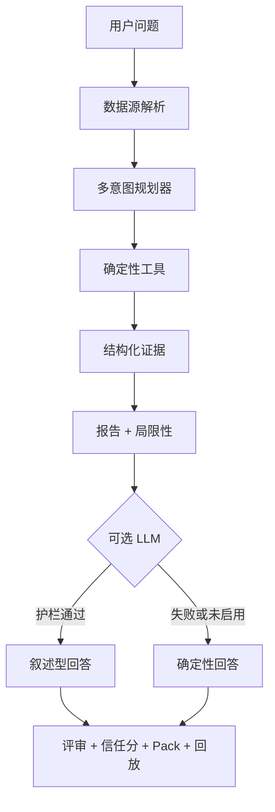

# BondLens AI

**面向中文债市数据的证据优先分析智能体**

[English](README.md) | [中文](README.zh-CN.md)


```text
数字由代码计算。
叙述可由大模型辅助。
每次输出都可追溯。
```

BondLens AI 是面向**中文债券市场**的轻量级 AI Agent 平台。
它把确定性计算、可选 LLM 叙述，以及面向审查者的 Trust Layer 合在一起：
数字可审计、回答可回放、局限性能诚实写出来。

> 本项目不提供投资建议，仅用于学习、研究、作品集展示和面试讨论。

项目主页：[https://phoenix0531-sudo.github.io/BondLens/](https://phoenix0531-sudo.github.io/BondLens/)

静态 Demo 证据包（无需 API Key）：[docs/demo_runs/](docs/demo_runs/)

---

## 设计原则：确定性计算，大模型叙述

BondLens 与 FinRobot 一类研究平台共享同一核心原则：
严格区分 **确定性金融计算** 与 **LLM 叙述**。

| 层级 | 来源 | 能否编造数字 |
| --- | --- | --- |
| 收益率 / 成交量 / 分位 / 排序 | 确定性工具 `bond_agent/tools.py` | 否 |
| 券种 / 期限分桶 / 同业利差 | 规则分类 + 纯 Python 统计 | 否 |
| 数据血缘（实时 / 快照 / 样本） | 数据解析器 | 否 |
| 证据账本 claim | 由工具输出构建 | 否 |
| 最终叙述文本 | 确定性报告；或仅在护栏+评审通过后用 LLM | 文本可润色，数字必须对齐证据 |

一句话：工具算数，模型讲故事，信任层做裁决。

---

## BondLens 能做什么

把一句自然语言问题变成一次**可审计的分析运行**：

1. 解析数据（AkShare 实时 → 本地快照 → Excel 样本）
2. 规划意图（概览 / 检索 / 排序 / 异常 / 监控 / 组合 / 单券报告）
3. 运行确定性工具
4. 构建结构化证据（市场、同业、监控、质量、期限覆盖）
5. 生成带风险说明与强制局限性的报告
6. 可选 LLM 润色（需通过数值与语言护栏）
7. 打信任分、导出 Evidence Pack、写入回放摘要

### 产品界面（答案优先）

- **首屏答案摘要**：3 句结论 + 关键指标；完整正文默认折叠
- **SSE 流式 + 软渲染终态**：工具阶段进度、token 预览、最终摘要卡无需强制整页跳转；完整看板仍可通过 `result_url`
- **双语 UI（默认中文）**：query/cookie 记忆语言，显式中/英切换，溯源行双语
- **券种结构 + 期限分桶**：保守名称规则，不做评级推断
- **同业可比**：同券种 + 同期限分桶相对利差
- **截面监控面板**：高收益 / 低成交 / 收益异常 / 缺期限
- **期限 / 残期看板**：覆盖率、现金流教学久期/DV01、永续双情景（首段有限 + 理论永续）
- **信任分 + 运行压力 + 审计折叠**：护栏 / 评审 / 风险 / 账本默认收起

---

## 架构

```text
Data Ops      实时 / 快照 / 本地样本 + 血缘 + 期限补全
Agent Core    Planner → Tools → Evidence → Report
Trust Layer   Guardrail + Judge + Risk + Trust Score + Replay + Evals
```



吸收业界「确定性计算 + LLM 叙述」原则，BondLens 在**中文债**垂直场景强化 claim 级证据、答案评审、红队评测与审查向 Evidence Pack——不是多角色股权研报桌面端。

---

## 项目截图

> 截图将在产品界面完全稳定后重新拍摄。
> `docs/screenshots/` 下现有图片仍对应较早的工作台版本；下方表格先保留旧图，避免 README 指向不存在的文件。

<table>
  <tr>
    <td width="50%">
      
      <br><strong>Agent 工作台</strong>
    </td>
    <td width="50%">
      
      <br><strong>最终回答、工具轨迹和证据</strong>
    </td>
  </tr>
  <tr>
    <td width="50%">
      
      <br><strong>风险画像和答案评审</strong>
    </td>
    <td width="50%">
      
      <br><strong>运行回放仪表盘</strong>
    </td>
  </tr>
</table>

### 建议重拍清单（你本地拍，再替换文件）

演示服务：`BOND_DATA_MODE=auto` 或 `static`，`http://[IP]:8765/agent`。

| 建议文件名 | 内容 | 推荐问法 |
| --- | --- | --- |
| `docs/screenshots/overview-zh.png` | 中文市场概览 | `当前债券市场样本概览如何？` |
| `docs/screenshots/bond-report-zh.png` | 中文单券报告 | `请对样本中第一只债券生成分析报告` |
| `docs/screenshots/advisory-refusal.png` | 投顾类拦截（不调 LLM） | `今天该不该买债？` |
| `docs/screenshots/agent-en.png` | 英文主界面（页头切 EN） | `Give an overview of the current bond market sample.` |

拍完后把 PNG 放到上表路径，再把 README 截图表格改指新文件即可。

---

## 快速上手

### 5 分钟（离线演示）

```bash
pip install -r requirements.txt
# 本地演示推荐绑定
export FLASK_RUN_HOST=[IP]
export PORT=8765
export BOND_DATA_MODE=static
export SECRET_KEY=local-dev
python app.py
# 打开 http://[IP]:8765/agent
# 试试：当前样本收益率分布是什么样？
```

或直接打开预生成证据包（无需服务）：

- [demo-market-overview.html](docs/demo_runs/demo-market-overview.html)
- [demo-bond-report.html](docs/demo_runs/demo-bond-report.html)
- [demo-yield-outliers.html](docs/demo_runs/demo-yield-outliers.html)

### 30 分钟（实时链路与降级）

```bash
export FLASK_RUN_HOST=[IP]
export PORT=8765
export BOND_DATA_MODE=auto   # 实时优先，失败后快照/本地
python app.py
# 强制实时：BOND_DATA_MODE=live
# 观察 data_source.runtime_mode、期限补全看板与信任分在降级时的变化
```

可选 LLM 润色（非必需）：

```bash
export OPENAI_API_KEY=[密钥]
export OPENAI_BASE_URL=http://[IP]:31876/v1   # 示例：本地 OpenAI 兼容网关（new-api）
export OPENAI_MODEL=deepseek-v4-flash-search  # 本机已验证；gpt/grok 通道常不可用
export OPENAI_API_STYLE=chat
export OPENAI_MODEL_FALLBACKS=gpt-5.4-mini,grok-4.5   # 可选；/models 探测会重排可用 id
# 密钥仅放进程环境变量，禁止写入仓库
```

---

## 语言（i18n）

- 默认界面语言：**中文**
- 页头显式切换（中 / EN）
- 记忆优先级：`?lang=zh|en` 查询参数 > `bondlens_lang` cookie > 默认 `zh`
- 覆盖范围：模板文案、意图/工具标签、确定性报告骨架、投顾类拒绝文案、flash/error 提示
- LLM 系统提示跟随当前语言；日志仍面向开发者，不追求全双语

---

## 工具目录（确定性算子）

| 工具 | 输入 | 确定性输出 |
| --- | --- | --- |
| `search_bonds` | 名称 / 券种 / 期限 / 收益率筛选 | 命中数、记录 |
| `describe_market` | 当前数据帧 | 收益/成交统计、结构、数据质量 |
| `rank_bonds` | 排序字段、top_n | 排名记录 |
| `detect_yield_outliers` | 方法、阈值 | 异常数、分数 |
| `compare_bond_to_market` | 单券 / 记录 | 分位、同业可比 |
| `build_market_monitor` | top_n | 高收益 / 低成交 / 异常 / 缺期限 |
| `generate_bond_report` | 工具输出 + 计划 | 分析、风险、局限性 |

最终回答中的数字必须来自上述工具（否则护栏拒绝）。

---

## 信任分与 Evidence Pack

每次回答包含 `trust_score`（0–100），由证据质量、数据新鲜度/降级、账本覆盖、护栏结果、评审结果与非投顾惩罚等构成。

每次运行可导出便携 **Bond Evidence Pack**（JSON + 静态 HTML）：

- 问题 / 意图 / 工具
- 数据血缘 + 期限覆盖
- 信任分与调整项
- 护栏 + 评审 + 风险画像
- 证据账本 + 最终回答
- 强制局限性

```bash
python scripts/generate_demo_packs.py
```

运行时导出：`.tmp/evidence_packs/`
仓库内 Demo：[docs/demo_runs/](docs/demo_runs/)

### 未匹配期限导出

实时/快照源**原生无期限字段**。BondLens 用本地证券主数据补全可匹配简称，并暴露：

```text
GET/POST /api/maturity/unmatched?format=csv&data_mode=static
GET/POST /api/maturity/unmatched?format=json&data_mode=static
```

页面上的「期限补全看板」提供相同导出入口。

---

## 示例问题

```text
当前样本收益率分布是什么样？
搜索23附息国债26并给出收益率分析
打开今日市场监控面板：高收益、低成交与异常
按收益率列出最高的前5只债券
有没有收益率异常的债券？
筛选国债收益率大于 2.5 的债券
今天该不该买债？   # 应触发 advisory 策略拦截，不调 LLM
```

---

## API

```http
POST /api/agent/query
Content-Type: application/json

{
  "question": "搜索23附息国债26并给出收益率分析",
  "data_mode": "auto"
}
```

流式接口（SSE）：

```http
POST /api/agent/stream
Content-Type: application/json

{
  "question": "当前债券市场样本概览如何？",
  "data_mode": "static"
}
```

事件包括 `status`（工具步骤）、`token`（增量文本）、`final`（软渲染视图 + `result_url`）。

运维接口：

```text
GET  /healthz
GET  /api/agent/schema
GET  /replay
GET  /packs/<pack_id>.html
GET  /packs/<pack_id>.json
GET  /api/maturity/unmatched
```

部署说明：[docs/deployment.md](docs/deployment.md)

---

## 数据源边界

```text
主源：    ChinaMoney / AkShare 风格现券成交抓取（优先直连）
快照：    .tmp/bond_spot_deal_snapshot.csv
最终备用： data/testdata.xlsx
```

- 实时字段包括简称、净价、收益率、涨跌 BP、加权收益、成交量，以及可用时的原生残期（`termToMaturity`）
- 残期仍可能不完整 → 覆盖率看板 + 弱覆盖时信任分惩罚
- 现金流久期 / DV01 为**教学级**平价票息估计，不是 OAS / 完整含权树定价
- 永续风格残期暴露双情景（首段有限 + 理论永续），不做伪造超长单一年限
- 无主体评级、财报、担保、信用事件
- 收益率是**风险信号**，不是交易指令

模式：

```text
auto   -> 实时优先，快照次之，本地兜底
live   -> 请求实时；降级时展示 fallback 原因
static -> 仅本地 Excel
```

---

## 为什么是 Agent，不是 Chatbot

1. **数据解析器**选择实时 / 快照 / 本地，并诚实记录血缘
2. **规划器**识别多意图并选择工具
3. **工具**对当前数据帧做纯 Python 分析
4. **证据**结构化并可写入账本
5. **报告**由证据生成，附带风险与局限性
6. **可选 LLM** 只能在本地证据之后叙述
7. **护栏 + 评审** 接受或拒绝模型文本
8. **信任分 + Evidence Pack + 回放** 让结果可审查，而不是甩原始 JSON

未设置 `OPENAI_API_KEY` 时，项目仍以确定性回退输出正常运行。

---

## 附录：LLM 最终答案矩阵（实测记录）

### 当前可用路径（2026-07）

基于本地 **new-api**（`http://[IP]:31876/v1`）、模型 **`deepseek-v4-flash-search`**、
`BOND_DATA_MODE=static`、`temperature=0`；护栏失败时允许一次数值修复重写。
单券报告稳定第一只债：**06国开24**（债券简称升序，mergesort）。

完整表：[docs/demo_runs/llm_matrix_deepseek_v4.md](docs/demo_runs/llm_matrix_deepseek_v4.md)
· 原始行：[llm_matrix_deepseek_v4.json](docs/demo_runs/llm_matrix_deepseek_v4.json)

| 场景 | 语言 | 门槛 | 结果 | 备注 |
| --- | --- | --- | --- | --- |
| 市场概览 | 中文 | 3/3 final LLM | **3/3** | 直接通过 |
| 单券报告 | 中文 | 3/3 final LLM | **3/3** | 直接通过 |
| 市场概览 | 英文 | >=2/3 | **2/3** | 1 次残留发明 `5%`；repair 可能救回 |
| 单券报告 | 英文 | >=2/3 | **3/3** | 久期%/分位发明被护栏 + repair 拦住 |

历史 `grok-4.5` 矩阵（相同门槛、更早通道）：
[docs/demo_runs/llm_matrix_grok45.md](docs/demo_runs/llm_matrix_grok45.md)。
在本机，`gpt-5.4*` / `grok-4.5` 通道常不可用或超时；
**deepseek-v4-flash-search** 是当前已验证的 chat 模型。

诚实残留：

- Provider 通道漂移仍会在模型消失时落到确定性回退
- 护栏保持开启；证据外数字不会成为最终答案
- 英文概览在通道噪声下仍可能发明 `5%` 一类 bare share；prompt + `market_focus_numbers` 降低概率，护栏仍失败关闭
- 一次 repair 只在数值护栏失败后重写；不是无条件放行
- deepseek 端到端延迟常见 8–25s；走 repair 时可能超过 40s
- 软渲染是摘要卡；完整看板表格仍在 `result_url`
- 未实现：WebSocket 行情、真 OAS / 完整含权永续定价、桌面 GUI/CLI

该矩阵证明主路径可用，**不是**零缺陷声明。

---

## 背景

本项目源自 2024 本科毕业设计：基于 Flask 的债券数据分析系统。
原毕设版本单独保留，不应被重写：

- 原毕设分支：`undergraduate-thesis-2024`
- 当前分支：`main`

## 许可证

MIT

## 免责声明

BondLens AI 是工程与研究演示。它不提供投资建议，不声称完整市场覆盖，也不能替代专业固收研究工具。
