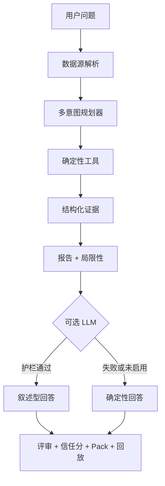

# BondLens：面向中文债市数据的证据优先分析智能体

[English](README.md) | [中文](README.zh-CN.md)

<div align="center">


**面向中文债的 claim 级证据智能体**  
中文债 · 确定性工具 · 可追溯证据 · 护權下的可选 LLM 叙述。


-10%2F10-brightgreen?style=flat-square)
-3%2F3-brightgreen?style=flat-square)


**BondLens** 把一句自然语言债市问题变成一次**可审计的分析运行**：  
实时 / 快照 / 本地数据 → 确定性工具 → 可选 LLM 叙述 → Trust Layer。

[项目主页](https://phoenix0531-sudo.github.io/BondLens/) · [社交预览图](docs/figs/voxel_social.png) · 浅底徽章：[logo](docs/figs/logo_white_background.png)

> 本项目不提供投资建议，仅用于学习、研究、作品集展示和面试讨论。

</div>

### Example Runs（无需 API Key — 浏览器直接打开）

| 运行 | 你会看到 | 打开 |
| --- | --- | --- |
| 市场概览 | 样本收益/成交看板 + 审查向 pack | [demo-market-overview.html](docs/demo_runs/demo-market-overview.html) |
| 单券报告 | 首券风格报告与证据正文 | [demo-bond-report.html](docs/demo_runs/demo-bond-report.html) |
| 收益异常 | 截面异常监控 pack | [demo-yield-outliers.html](docs/demo_runs/demo-yield-outliers.html) |
| LLM 终答矩阵 | 已记录的 CPA 路径（中英 × 概览/单券） | [llm_matrix_cpa_gpt54.md](docs/demo_runs/llm_matrix_cpa_gpt54.md) |

同目录还有对应 JSON：[docs/demo_runs/](docs/demo_runs/)。

---

## 目录

- [范围](#范围)
- [设计原则](#设计原则确定性计算大模型叙述)
- [架构](#架构)
- [项目截图](#项目截图)
- [快速上手](#快速上手)
- [语言（i18n）](#语言i18n)
- [工具目录](#工具目录确定性算子)
- [信任分与 Evidence Pack](#信任分与-evidence-pack)
- [示例问题](#示例问题)
- [API](#api)
- [数据源边界](#数据源边界)
- [LLM 实测路径（recorded）](docs/demo_runs/llm_matrix_cpa_gpt54.md)
- [背景](#背景)
- [许可证](#许可证)
- [免责声明](#免责声明)

---

## 范围

| 在范围内 | 不在范围内 |
| --- | --- |
| 中文债市自然语言问答 | 多 Agent 股权研究桌面端 |
| 实时 / 快照 / 本地数据，血缘可追溯 | 主体评级、财报、担保、信用事件 |
| 确定性收益 / 成交 / 排序 / 异常工具 | 交易推荐或买卖信号 |
| 可选 LLM 叙述（数值 + 语言护栏） | 模型在证据外编造数字 |
| 信任分、Evidence Pack、回放、红队评测 | 完整 OAS / 含权树定价 desk |
| 双语界面（默认中文）+ 便携 demo pack | 完整市场覆盖声明 |

**诚实体量：** 项目 Python 约 1 万行（`bond_agent/` + app/tests/evals）——垂直产品，不是 10 万+ 多 Agent 平台。

---

## 设计原则：确定性计算，大模型叙述

BondLens 严格区分 **确定性金融计算**（工具不编造数字）与 **LLM 叙述**（仅文本，数字必须对齐证据）。详见 [工具目录](#工具目录确定性算子) 的确定性产出与下文 [信任分与 Evidence Pack](#信任分与-evidence-pack) 中控制叙述文本的护栏 + 评审。

**工具算数，模型讲故事，信任层做裁决。** 未设置 `OPENAI_API_KEY` 时，项目仍以确定性回退输出正常运行。

### Codebase Snapshot

| 层级 | 包含内容 |
| --- | --- |
| **Agent 核心** | 单路径：Planner → Tools → Evidence → Report |
| **确定性工具** | 7 个公开算子：`search_bonds`、`describe_market`、`rank_bonds`、`detect_yield_outliers`、`compare_bond_to_market`、`build_market_monitor`、`generate_bond_report` |
| **Trust 层** | 数值+语言护栏 · 答案评审 · Trust 分 · Evidence Pack · 回放 · 风险画像 |
| **评测** | 约 110 个 pytest · CI Docker `/healthz`；详见上方实时 badge。 |
| **数据** | AkShare 实时 → 缓存快照 → 静态 Excel，显式血缘与期限覆盖看板 |
| **产品面** | Flask + Jinja · 默认中文 / 英文切换（query+cookie）· SSE 软渲染 · CI + GitHub Pages |

---

### 产品面（答案优先）

- **Answer Snapshot** + SSE 软终渲染：工具步骤进度、token 预览、最终摘要卡，无需强制整页刷新；完整看板仍走 `result_url`
- **双语界面（默认中文）** + 期限/残期看板：高收益 / 低成交 / 收益异常 / 缺期限；同券种 + 同分桶同业利差
- **信任分 + 压力视图 + 审计折叠**：护栏 / 评审 / 风险 / 账本收在 details 后；回放看板可查过去运行

详见下文 [项目截图](#项目截图) 中每一项的实际表现。

---

## 架构

<div align="center">

</div>



详见 [工具目录](#工具目录确定性算子) 中规划器→工具使用的 7 个确定性算子。

---

## 项目截图

在当前 live agent 页实拍（`BOND_DATA_MODE=auto`，无 API Key → 确定性最终答案）。
叙事：**能答 · 能深 · 会拒 · 会排序 · 可双语 · 可审**。

当前产品图集中在 `docs/screenshots/current/`；根截图目录只保留 GitHub social preview 资产。

<table>
  <tr>
    <td width="50%">
      
      <br><strong>默认中文 — 干净控制台</strong>
      <br>只有页头语言切换；控制台不再重复放语言选择器。
    </td>
    <td width="50%">
      
      <br><strong>能答 — 市场概览</strong>
      <br><code>当前债券市场样本概览如何？</code>
    </td>
  </tr>
  <tr>
    <td width="50%">
      
      <br><strong>能深 — 单券报告</strong>
      <br><code>请对样本中第一只债券生成分析报告</code>
    </td>
    <td width="50%">
      
      <br><strong>会拒 — 投顾策略拦截</strong>
      <br><code>今天该不该买债？</code> → Trust ≤72，不调 LLM
    </td>
  </tr>
  <tr>
    <td width="50%">
      
      <br><strong>会排序 — 高收益证据清单</strong>
      <br><code>收益率最高的债券是哪只？</code>
    </td>
    <td width="50%">
      
      <br><strong>英文界面 — 同一控制台切换语言</strong>
      <br>页头 `EN` 驱动产品界面。
    </td>
  </tr>
  <tr>
    <td width="50%">
      
      <br><strong>英文问答链路 — 市场概览</strong>
      <br><code>Give an overview of the current bond market sample.</code>
    </td>
    <td width="50%">
      
      <br><strong>可审 — 回放 / 证据路径</strong>
      <br>历史运行回放看板（可追溯输出）。
    </td>
  </tr>
</table>

---

## 快速上手

### 0 分钟（无需安装）

浏览器直接打开预生成 Example Run——无需服务、无需 API Key：

```text
docs/demo_runs/demo-market-overview.html
```

或从上方 [Example Runs 表](#example-runs无需-api-key--浏览器直接打开) 跳转。

### 5 分钟（离线演示）

```bash
pip install -r requirements.txt
./scripts/run_demo.sh
# 打开 http://127.0.0.1:8765/agent
# 试试：当前样本收益率分布是什么样？
```

Windows 也可以直接运行：

```bat
scripts\run_demo.bat
```

其他 pack：

- [demo-market-overview.html](docs/demo_runs/demo-market-overview.html)
- [demo-bond-report.html](docs/demo_runs/demo-bond-report.html)
- [demo-yield-outliers.html](docs/demo_runs/demo-yield-outliers.html)

### 30 分钟（实时链路与降级）

```bash
export FLASK_RUN_HOST=127.0.0.1
export PORT=8765
export BOND_DATA_MODE=auto   # 实时优先，失败后快照/本地
python app.py
# 强制实时：BOND_DATA_MODE=live
# 观察 data_source.runtime_mode、期限补全看板与信任分在降级时的变化
```

可选 LLM 润色（非必需）：

```bash
export OPENAI_API_KEY=... OPENAI_BASE_URL=http://127.0.0.1:18317/v1   # 示例：本地 CPA/OpenAI 兼容网关
export OPENAI_MODEL=haochi/gpt-5.4
export OPENAI_API_STYLE=chat
export OPENAI_MODEL_FALLBACKS=haochi/gpt-5.4-mini,gongyi/deepseek-v4-flash-search   # 可选
# 密钥仅放进程环境变量，禁止写入仓库
```

### Docker 演示

BondLens 已提供 Docker 打包，但作品集演示不强依赖 Docker。
Compose 服务名固定为 `bondlens`，容器名 `bondlens-demo`，镜像名 `bondlens:local`，宿主机 `8765` 映射到容器内 `5000`。

```bash
docker compose up --build
# 打开 http://localhost:8765/agent
# 健康检查：http://localhost:8765/healthz
```

---

## 语言（i18n）

- 默认界面语言：**中文**
- 一处显式切换：页头 `中 / EN`
- 记忆优先级：`?lang=zh|en` 查询参数 > `bondlens_lang` cookie > 默认 `zh`（前端 localStorage 同步）
- 覆盖范围：模板文案、意图/工具标签、确定性报告骨架、投顾类拒绝文案、flash/error 提示
- LLM 系统提示跟随当前语言；日志仍面向开发者，不追求全双语

---

## 工具目录（确定性算子）

| 工具 | 输入 | 确定性输出 |
| --- | --- | --- |
| `search_bonds` | 名称 / 券种 / 期限 / 收益率筛选 | 命中数、记录 |
| `describe_market` | 当前数据帧 | 收益/成交统计、结构、数据质量 |
| `rank_bonds` | 排序字段、top_n | 排名记录 |
| `detect_yield_outliers` | 方法、阈值 | 异常数、分数 |
| `compare_bond_to_market` | 单券 / 记录 | 分位、同业可比 |
| `build_market_monitor` | top_n | 高收益 / 低成交 / 异常 / 缺期限 |
| `generate_bond_report` | 工具输出 + 计划 | 分析、风险、局限性 |

最终回答中的数字必须来自上述工具（否则护栏拒绝）。

---

## 信任分与 Evidence Pack

每次回答包含 `trust_score`（0–100），由证据质量、数据新鲜度/降级、账本覆盖、护栏结果、评审结果与非投顾惩罚等构成。

每次运行可导出便携 **Bond Evidence Pack**（JSON + 静态 HTML）：

- 问题 / 意图 / 工具
- 数据血缘 + 期限覆盖
- 信任分与调整项
- 护栏 + 评审 + 风险画像
- 证据账本 + 最终回答
- 强制局限性

```bash
python scripts/generate_demo_packs.py
```

运行时导出：`.tmp/evidence_packs/`
仓库内 Demo：[docs/demo_runs/](docs/demo_runs/)

### 未匹配期限导出

实时/快照源**原生无期限字段**。BondLens 用本地证券主数据补全可匹配简称，并暴露：

```text
GET/POST /api/maturity/unmatched?format=csv&data_mode=static
GET/POST /api/maturity/unmatched?format=json&data_mode=static
```

页面上的「期限补全看板」提供相同导出入口。

---

## 示例问题

```text
当前样本收益率分布是什么样？
搜索23附息国债26并给出收益率分析
打开今日市场监控面板：高收益、低成交与异常
按收益率列出最高的前5只债券
有没有收益率异常的债券？
筛选国债收益率大于 2.5 的债券
今天该不该买债？   # 应触发 advisory 策略拦截，不调 LLM
```

---

## API

```http
POST /api/agent/query
Content-Type: application/json

{
  "question": "搜索23附息国债26并给出收益率分析",
  "data_mode": "auto"
}
```

流式接口（SSE）：

```http
POST /api/agent/stream
Content-Type: application/json

{
  "question": "当前债券市场样本概览如何？",
  "data_mode": "static"
}
```

事件包括 `status`（工具步骤）、`token`（增量文本）、`final`（软渲染视图 + `result_url`）。

运维接口：

```text
GET  /healthz
GET  /api/agent/schema
GET  /replay
GET  /packs/<pack_id>.html
GET  /packs/<pack_id>.json
GET  /api/maturity/unmatched
```

部署说明：[docs/deployment.md](docs/deployment.md)

---

## 数据源边界

```text
主源：    ChinaMoney / AkShare 风格现券成交抓取（优先直连）
快照：    .tmp/bond_spot_deal_snapshot.csv
最终备用： data/testdata.xlsx
```

- 实时字段包括简称、净价、收益率、涨跌 BP、加权收益、成交量，以及可用时的原生残期（`termToMaturity`）
- 残期仍可能不完整 → 覆盖率看板 + 弱覆盖时信任分惩罚
- 现金流久期 / DV01 为**教学级**平价票息估计，不是 OAS / 完整含权树定价
- 永续风格残期暴露双情景（首段有限 + 理论永续），不做伪造超长单一年限
- 无主体评级、财报、担保、信用事件
- 收益率是**风险信号**，不是交易指令

模式：

```text
auto   -> 实时优先，快照次之，本地兜底
live   -> 请求实时；降级时展示 fallback 原因
static -> 仅本地 Excel
```

---

## LLM 实测路径（recorded）

一份基于本地 CPA/OpenAI 兼容网关的 LLM 主路径记录（中/英 × 概览/单券报告）及其诚实残留，见 [docs/demo_runs/llm_matrix_cpa_gpt54.md](docs/demo_runs/llm_matrix_cpa_gpt54.md)。该矩阵证明主路径可用，**不是**零缺陷声明；Provider 通道漂移仍会在模型消失时落到确定性回退，无 API Key 时项目也能用确定性报告正常运行。

---

## 背景

本项目源自 2024 本科毕业设计：基于 Flask 的债券数据分析系统。
原毕设版本单独保留，不应被重写：

- 原毕设分支：`undergraduate-thesis-2024`
- 当前分支：`main`

## 许可证

MIT

## 免责声明

BondLens 是工程与研究演示。它不提供投资建议，不声称完整市场覆盖，也不能替代专业固收研究工具。
