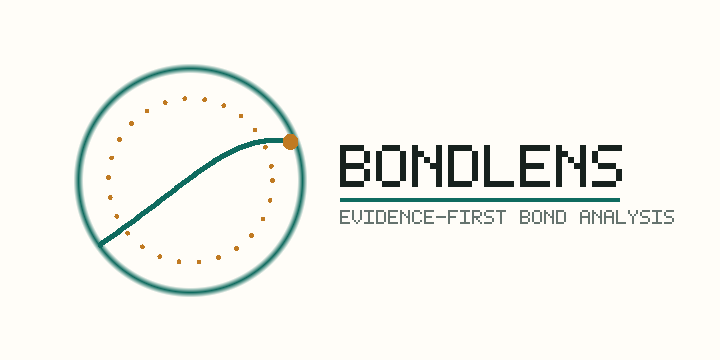

# BondLens: An Evidence-First Bond Analysis Agent for Chinese Market Data

<div align="center">



**Numbers are code-calculated. Narratives are LLM-assisted. Every output is provenance-tracked.**


</div>

BondLens is a lightweight agent for **Chinese bond market analysis**.
It turns a natural-language question into an auditable run with live/snapshot/static data, deterministic tools, optional LLM narration under guardrails, and a reviewer-facing Trust Layer.

**Not a multi-agent equity research desktop.**
**A claim-level evidence agent for Chinese bonds.**

## Example Runs (no API key — open in browser)

| Run | Open |
| --- | --- |
| Market overview | [demo-market-overview.html](https://github.com/Phoenix0531-sudo/BondLens/blob/main/docs/demo_runs/demo-market-overview.html) |
| Single-bond report | [demo-bond-report.html](https://github.com/Phoenix0531-sudo/BondLens/blob/main/docs/demo_runs/demo-bond-report.html) |
| Yield outliers | [demo-yield-outliers.html](https://github.com/Phoenix0531-sudo/BondLens/blob/main/docs/demo_runs/demo-yield-outliers.html) |
| LLM final-answer matrix | [llm_matrix_deepseek_v4.md](https://github.com/Phoenix0531-sudo/BondLens/blob/main/docs/demo_runs/llm_matrix_deepseek_v4.md) |

## Codebase Snapshot

| Layer | What it includes |
| --- | --- |
| Agent core | Planner → Tools → Evidence → Report (single path) |
| Deterministic tools | 7 public operators |
| Trust layer | Guardrail · judge · Trust score · Evidence Pack · replay |
| Evals | ~110 pytest · agent 10/10 · red-team 3/3 · Docker healthz |
| Data | live → snapshot → static with lineage |
| Product | Flask + Jinja · zh/en · SSE soft-render · CI + Pages |

## Quick links

- Repository: <https://github.com/Phoenix0531-sudo/BondLens>
- English README: <https://github.com/Phoenix0531-sudo/BondLens/blob/main/README.md>
- 中文 README: <https://github.com/Phoenix0531-sudo/BondLens/blob/main/README.zh-CN.md>
- Architecture diagram: <https://github.com/Phoenix0531-sudo/BondLens/blob/main/docs/figs/architecture.png>
- CI: <https://github.com/Phoenix0531-sudo/BondLens/actions/workflows/ci.yml>

## Local quick start

```bash
cp .env.example .env
docker compose up --build
# or: PORT=8765 BOND_DATA_MODE=auto python app.py
```

## License

MIT. Non-investment advice — learning, research, portfolio demonstration, and interview discussion only.
